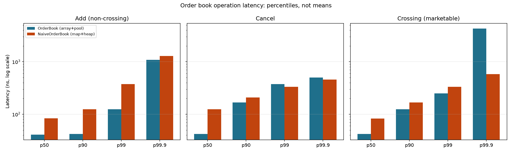
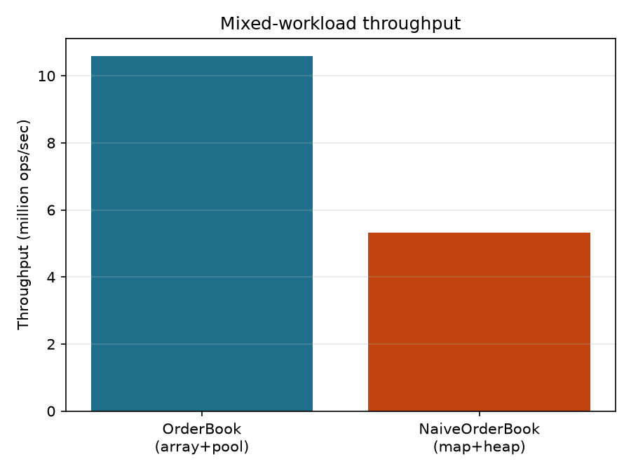

# Low-Latency Limit Order Book

[](https://github.com/Seb-L-P/low-latency-order-book/actions/workflows/ci.yml)

A price-time priority matching engine in C++20, designed around the two things that actually make an order book fast: O(1) access to any price level (an array indexed directly by price, not a tree), and zero heap allocation on the hot path (a fixed-capacity object pool instead of `new`/`delete` per order). Validated against an independently-implemented `std::map`-based reference book via differential testing on 20,000+ randomized operations, and benchmarked on full latency percentile distributions, not just means.

Fifth in a series of quant-adjacent portfolio projects (Monte Carlo blackjack, options pricing, Avellaneda-Stoikov market making, portfolio risk) — the first in C++ rather than Python. That's a deliberate choice, not a style preference: "low latency" is a real claim that Python's GIL and garbage collector structurally undermine, and a low-latency system built in a language that can't back up the claim would read as a red flag, not a portfolio piece, at any firm that does this for real.

## CV bullet

> **Low-Latency Limit Order Book — C++20 · [GitHub]**
> - Built a price-time priority matching engine with O(1) order insertion and cancellation: a fixed-range array-indexed price ladder (vs. O(log n) tree lookup), intrusive doubly-linked lists for time priority, and a fixed-capacity object pool to eliminate `malloc`/`free` from the hot path
> - Validated correctness via differential testing: 20,000+ randomized operations run in lockstep against an independently-implemented `std::map`-based reference book, asserting identical trades and best bid/ask after every single operation
> - Benchmarked full latency percentile distributions (not just means) against that baseline: 2-3x lower p50 latency on order entry and cancellation, and 2x higher sustained throughput (10.6M vs. 5.3M ops/sec) — while also finding and explaining a genuine tail-latency tradeoff (7x worse p99.9 on marketable orders) traced directly to the array design's level-refresh scan cost, not treated as a inconvenient number to hide

## Results

Build: `-O3`, Apple Clang 21. Benchmarks run on a shared development machine, not an isolated/real-time-tuned box — see Limitations for what that means for the tail numbers specifically. Reproduce with `./build/benchmark` (from the project root, so `results/*.csv` resolve) then `python scripts/plot_results.py`.

### Latency: percentiles, not means



| Operation | Metric | OrderBook (array+pool) | NaiveOrderBook (map+heap) |
|---|---|---:|---:|
| Add (non-crossing) | p50 | **41 ns** | 84 ns |
| Add (non-crossing) | p99.9 | 1,083 ns | 1,292 ns |
| Add (non-crossing) | max | **18,375 ns** | 437,959 ns |
| Cancel | p50 | **42 ns** | 125 ns |
| Cancel | p99.9 | 500 ns | 459 ns |
| Crossing (marketable) | p50 | **42 ns** | 83 ns |
| Crossing (marketable) | p99.9 | 4,291 ns | **583 ns** |

Median (p50) latency is 2-3x lower across every operation type — the direct payoff of O(1) array indexing plus pool allocation over tree lookup plus heap allocation. The **add** benchmark's `max` column is the most dramatic single number in the whole project: the naive book's worst observed add took 438 microseconds, 24x the array book's worst case. That's consistent with (not definitively profiled down to) the general-purpose allocator occasionally needing to request more memory from the OS as thousands of individually-`new`'d list/tree nodes accumulate — exactly the kind of unpredictable-cost event a pool allocator exists to eliminate.

### Throughput



A realistic mixed workload (80% new orders, 15% cancels, 5% marketable orders — real markets see far more cancels than fills) sustains **10.6M ops/sec** on the array+pool book vs. **5.3M ops/sec** on the naive one, measured as wall-clock time over 500,000 operations.

### The honest finding: the array design has a real tail-latency cost, and it shows up exactly where predicted

The crossing-order benchmark's p99.9 is the one number in this whole project that favors the naive book — **4,291 ns vs. 583 ns, a 7x gap in the naive book's favor** — and it reproduces consistently across repeated runs, not a one-off fluke. This is not a bug. It's the exact tradeoff documented in `order_book.hpp` before a single benchmark was ever run: when the best bid/ask level empties, finding the next best level means scanning outward through the array until a non-empty one turns up. A marketable order that sweeps through several price levels in one call can trigger that scan multiple times in a row, and the scan's cost depends on how *sparse* the occupied levels are — in this benchmark, replenishment liquidity is spread randomly across a wide price range, which makes the average gap between occupied levels large enough for the scan cost to show up clearly. A denser, more realistically liquid book would show a smaller effect; a book that goes through violent one-sided liquidity droughts would show a larger one. `std::map`'s O(log n) tree lookup doesn't have this failure mode at all — its cost is *stable* regardless of how sparse the book is, which is exactly the well-known array-vs-tree tradeoff (better average case, worse worst case, vs. stable but slower always) playing out in real measured numbers instead of just being asserted in a comment.

## Correctness: differential testing

Unit tests (`tests/test_order_book.cpp`) check specific scenarios I thought to write down: partial fills, multi-level walks, cancel refreshing the best price, quantity-reduction preserving time priority. `tests/test_differential.cpp` checks something stronger — that two *independently implemented* books, with completely different internal data structures, produce **identical** externally observable behavior (every trade, every best bid/ask, after every single one of 20,000 randomized operations) when fed the exact same order flow. If the array book's best-price refresh logic or level-walking had a subtle bug, it would have to coincidentally reproduce the tree-based book's completely different logic to slip through this test undetected — vanishingly unlikely for a real bug. The randomized flow exercises limit orders, market orders, immediate-or-cancel orders, and cancels, and periodically compares full 10-level L2 depth snapshots (`top_levels`) between the two books, not just the touch. All 23 tests pass on a clean `-Wall -Wextra` build with no warnings, and CI re-runs the whole suite on GCC and Clang plus a dedicated AddressSanitizer + UndefinedBehaviorSanitizer build — the sanitizer run matters more than usual here because the fast book is built on raw intrusive pointers and placement-new, exactly the kind of code where a lifetime bug hides silently until it doesn't.

**Order-ID hygiene is enforced, not assumed.** Submitting an order whose ID is already live is rejected (`std::invalid_argument`) rather than silently accepted. The failure mode this prevents is nasty: a duplicate ID would overwrite the cancel-lookup entry for the earlier order, making it uncancellable and leaking its pool slot — the kind of state corruption that no unit test of "normal" flow would ever surface. Real venues reject duplicate client order IDs at the gateway for the same reason. IDs become reusable once the order they named is filled or canceled (uniqueness is among *live* orders).

## Methodology

**Prices are integers, never floating point** (`types.hpp`). A `double` can't represent most decimal prices exactly, which means a naive float comparison for "is this the best price" can misbehave right at a level boundary — exactly where a matching engine can least afford it. Real exchanges represent price the same way: an integer tick count, with any real-currency tick size applied only at the display boundary, never inside the matching logic.

**The price ladder is a flat array, not a tree** (`order_book.hpp`). Both sides get a `std::vector<PriceLevel>` covering a bounded, contiguous integer price range, indexed directly by `price - min_price`. This works because a real order book trades in a bounded range around the current price for any given instrument — pre-allocating the full range up front turns "find this price level" from a pointer-chasing tree traversal into a single array index. The cost of this choice — the level-refresh scan when the touch empties — is the subject of the tail-latency finding above, stated as a tradeoff up front in the code comments, not discovered after the fact.

**Time priority within a level is an intrusive doubly-linked list** (`price_level.hpp`). "Intrusive" means the linked-list pointers live inside the `Order` struct itself, not in a separate node wrapper the way `std::list` would do it — one fewer allocation per order, no extra indirection to reach the payload. `push_back` and removing *any* node given a pointer to it (front, back, or middle) are both O(1), which is exactly the two operations a matching engine needs on its hot path.

**Order types: limit, market, and immediate-or-cancel** (`order_book.hpp`). All three share the single matching path (`match_against_book`); they differ only in their price bound (a market order matches at an unbounded price) and their rest policy (market and IOC never rest a remainder). Keeping one matching path means the differential test covers all three order types through the same code, rather than each type having its own separately-buggy walk logic.

**L2 depth snapshots** (`top_levels`). The book exposes the top-N aggregated levels per side (price, total quantity, order count), best-first — the read path a market-data publisher or a strategy's signal calculation would use. It returns plain values, not pointers into book internals, so a snapshot stays valid after the book mutates.

**No allocation on the hot path** (`object_pool.hpp`). One large block is allocated up front; `acquire`/`release` are a vector push/pop plus a placement-new or explicit destructor call, O(1) with no call into the general-purpose allocator at all. Fixed capacity is deliberate: a real matching engine sizes its order pool to the maximum resting-order count it's willing to support and fails loudly if that's exceeded, rather than silently falling back to slow, unbounded allocation exactly when the book is busiest.

**The naive baseline is a genuine, separately-reasoned implementation** (`naive_order_book.hpp`), not a strawman — `std::map<Price, std::list<Order>>` per side (the data structures most people reach for before thinking about cache behavior), with an `unordered_map<OrderId, ...>` for cancel lookup, because even a non-specialist would likely still want O(1)-ish cancel-by-id. It isolates two bundled optimizations at once (array-vs-tree *and* pool-vs-heap-allocation) rather than each in isolation — an honest scoping choice, noted rather than hidden; see Limitations.

**Benchmark methodology** (`benchmarks/`). Every benchmark generates its random operation parameters *before* starting the timer and stops it immediately after the single call being measured, so RNG and setup cost never contaminate a latency sample. Percentiles, not means, are reported throughout: a mean can look great while hiding a heavy tail, and tail latency is what a low-latency system actually lives or dies on. Both books are driven by the identical seeded random sequence in every benchmark, so a difference in results is attributable to the data structure, not to one book getting luckier order flow — the same common-random-numbers principle used throughout every project in this series.

## Assumptions & limitations

- **Benchmarked on a shared development machine**, not an isolated core with real-time scheduling priority, disabled frequency scaling, or interrupts pinned elsewhere. p50/p90 are reasonably stable and reproducible across runs; `max` in particular can be inflated by ordinary OS scheduling noise unrelated to the algorithm. A real low-latency shop's benchmark rig controls for all of this; this project's numbers should be read as directionally real and mechanistically explained, not as production-grade measurements.
- **`std::chrono::steady_clock`, not a cycle counter.** Real low-latency benchmarking often uses `rdtsc` (a CPU cycle-counter intrinsic) for finer-grained, lower-overhead timing than a library clock call. Not used here for portability (it's platform/architecture-specific); noted as the natural next step, not silently substituted without comment.
- **Bounded, pre-allocated price range.** The array design assumes prices stay within a configured range; an order priced outside it is rejected (`std::out_of_range`) rather than silently handled by growing the array, which would defeat the whole point of O(1) indexing.
- **Single-threaded.** No lock-free structures, no concurrent order entry — a real production matching engine typically has a single-writer/single-reader-per-symbol design for exactly the correctness reasons that make this a reasonable simplification, but multi-threaded order entry across symbols is a real next step, not modeled here.
- **The naive baseline bundles two optimizations' worth of difference** (data structure *and* allocation strategy) into one comparison rather than isolating each. A cleaner (if more code) design would benchmark array+heap-alloc and tree+pool as intermediate points to attribute the speedup to each factor separately.

## Project structure

```
include/lob/
  types.hpp             Price/Qty/OrderId as integers, Order/Trade/Side
  object_pool.hpp        fixed-capacity pool allocator, placement new
  price_level.hpp         intrusive doubly-linked list, O(1) FIFO
  order_book.hpp           the fast book: array-indexed levels + pool
  naive_order_book.hpp      the baseline: std::map + std::list
tests/
  test_framework.hpp       minimal header-only test harness, no dependencies
  test_object_pool.cpp     pool lifecycle
  test_price_level.cpp     FIFO ordering, removal from head/middle/tail
  test_order_book.cpp      partial fills, multi-level walks, cancel, time priority
  test_differential.cpp    fast vs. naive on 20,000 randomized operations
benchmarks/
  stats.hpp                 percentile computation
  benchmark_main.cpp         latency (add/cancel/cross) + throughput, fast vs. naive
scripts/
  plot_results.py            reads the benchmark CSVs, produces the plots above
results/                    generated CSVs and plots from the run above
```

## Running it

```bash
mkdir build && cd build
cmake .. -DCMAKE_BUILD_TYPE=Release
cmake --build . -j

./run_tests          # 20 tests, including the 20,000-op differential test
cd ..
./build/benchmark    # run from the project root so results/*.csv resolve
python3 -m venv .venv && source .venv/bin/activate && pip install -r requirements.txt
python scripts/plot_results.py
```

## Possible extensions

- Binary market-data feed parsing (ITCH-style) to reconstruct a book from a message stream instead of direct API calls
- Replay real historical tick data (e.g. LOBSTER) through the engine instead of synthetic order flow
- Wire the Avellaneda-Stoikov quoting policy from the market-making project into this book in place of its reduced-form Poisson arrival model — that project's own "possible extensions" section names this directly
- `rdtsc`-based cycle-accurate timing and a proper isolated-core benchmark methodology (CPU pinning, disabled frequency scaling)
- Attribute the naive-vs-fast speedup to data structure and allocation strategy separately, rather than bundled together
- Cache-line-aware layout and alignment for `Order`/`PriceLevel` (`alignas(64)`), and a look at false sharing if this were ever made concurrent
